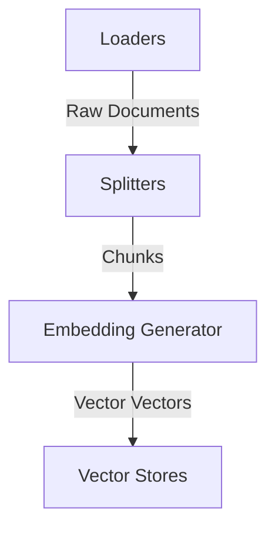

# Retrieval-Augmented Generation (RAG) Pipeline

LLMesh provides a fluent, immutable, and end-to-end RAG ingestion pipeline to load, split, embed, and store documents in vector databases.

---

## Architecture Overview

The RAG pipeline operates on a workflow composed of four pluggable components:



---

## 1. Loaders

Loaders ingest data from different sources and output an array of `Document` DTOs.

- **`TextLoader`**: Loads a single file from a path as one document.
- **`DirectoryLoader`**: Recursively loads all files matching target extensions in a directory.
- **`ArrayLoader`**: Wraps raw string values directly into documents.

### Example: Loading Documents

```php
use LLMesh\Core\RAG\Loaders\DirectoryLoader;

// Load all markdown files in a directory
$loader = new DirectoryLoader('/path/to/docs', ['md']);
$documents = $loader->load();
```

---

## 2. Splitters

Splitters divide large documents into smaller semantic chunks to fit context windows and improve retrieval precision.

- **`RecursiveCharacterSplitter`**: Recursively splits text by a hierarchy of characters (newlines, spaces, etc.) to keep paragraphs and sentences intact, respecting a max `chunkSize` and `overlap`.
- **`SentenceSplitter`**: Groups whole sentences into chunks, preserving sentence boundaries.

### Example: Splitting Documents

```php
use LLMesh\Core\RAG\Splitters\RecursiveCharacterSplitter;

$splitter = new RecursiveCharacterSplitter(
    chunkSize: 1000,
    overlap: 200
);
```

---

## 3. Vector Stores

Vector Stores save the text chunks and their high-dimensional embedding vectors for similarity search.

- **`InMemoryVectorStore`**: A fast, in-memory store suitable for testing and transient caching.
- **`PgVectorStore`**: A production-ready store backed by PostgreSQL and the `pgvector` extension.

### Example: Configuring PostgreSQL Vector Store

```php
use LLMesh\Core\RAG\VectorStores\PgVectorStore;

$pdo = new PDO('pgsql:host=localhost;dbname=llmesh', 'username', 'password');
$vectorStore = new PgVectorStore($pdo, tableName: 'embeddings', dimension: 1536);
```

---

## 4. End-to-End Pipeline Ingestion

You can assemble these components fluently into a RAG ingestion pipeline:

```php
use LLMesh\Core\RAG\Pipeline;
use LLMesh\Core\RAG\Loaders\DirectoryLoader;
use LLMesh\Core\RAG\Splitters\RecursiveCharacterSplitter;
use LLMesh\OpenAI\OpenAIProvider;
use LLMesh\Core\RAG\VectorStores\PgVectorStore;

// Fluent & Immutable construction
$result = Pipeline::make()
    ->load(new DirectoryLoader('/path/to/docs', ['txt']))
    ->split(new RecursiveCharacterSplitter(500, 50))
    ->embed(new OpenAIProvider($apiKey))
    ->store($vectorStore)
    ->onProgress(function (int $current, int $total) {
        echo "Ingested chunk {$current} of {$total}\n";
    })
    ->run();

echo "Successfully ingested {$result->getChunkCount()} chunks.\n";
```
